<table>
<tr>
  <td>Latest Release</td>
  <td>
    <div>
    
    </div>
    </a>
  </td>

  <td>Downloads</td>
  <td>
    <div>
    
    </div>
  </td>
</tr>

<tr>
  <td>License</td>
  <td>
    <a href="https://github.com/makepath/xarray-spatial/blob/master/LICENSE.txt">
    
    </a>
  </td>

  <td>People</td>
  <td>
    
  </td>
</tr>

<tr>
  <td>Build Status</td>
  <td>
    <div>
    <a href="https://github.com/makepath/xarray-spatial/actions/workflows/test.yml">
    
    </a>
    </div>
    <div>
    <a href="https://github.com/makepath/xarray-spatial/actions/workflows/pypi-publish.yml">
    
    </a>
    </div>
    <div>
      <a href='https://xarray-spatial.readthedocs.io/en/latest/?badge=latest'>
        
      </a>
    </div>
  </td>
  <td>Coverage</td>
  <td>
    <div>
      <a href="https:https://codecov.io/gh/makepath/xarray-spatial">
      
      </a>
    </div>
  </td>

</tr>
</table>

-------


[](https://makepath.com/history-of-open-source-gis/)


-------
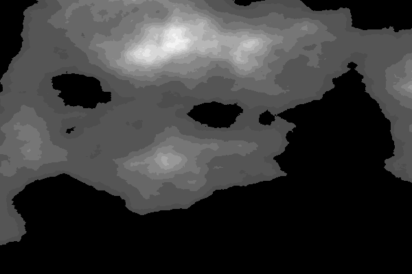
-------
:round_pushpin: Fast, Accurate Python library for Raster Operations

:zap: Extensible with [Numba](http://numba.pydata.org/)

:fast_forward: Scalable with [Dask](http://dask.pydata.org)

:confetti_ball: Free of GDAL / GEOS Dependencies

:earth_africa: General-Purpose Spatial Processing, Geared Towards GIS Professionals

-------

Xarray-Spatial implements common raster analysis functions using Numba and provides an easy-to-install, easy-to-extend codebase for raster analysis.

### Installation
```bash
# via pip
pip install xarray-spatial

# via conda
conda install -c conda-forge xarray-spatial
```

### Downloading our starter examples and data
Once you have xarray-spatial installed in your environment, you can use one of the following in your terminal (with the environment active) to download our examples and/or sample data into your local directory.

```xrspatial examples``` : Download the examples notebooks and the data used.

```xrspatial copy-examples``` : Download the examples notebooks but not the data. Note: you won't be able to run many of the examples.

```xrspatial fetch-data``` : Download just the data and not the notebooks.

In all the above, the command will download and store the files into your current directory inside a folder named 'xrspatial-examples'.


| | | | | |
|:-------------------------:|:-------------------------:|:-------------------------:|:-------------------------:|:-------------------------:|
|<a href="/examples/"></a>                           | <a href="/examples/user_guide/2_Proximity.ipynb">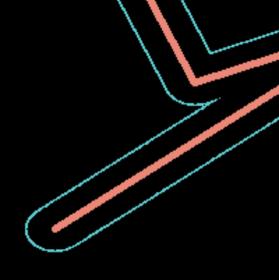</a>     |<a href="/examples/user_guide/2_Proximity.ipynb"></a>     |<a href="/examples/user_guide/2_Proximity.ipynb">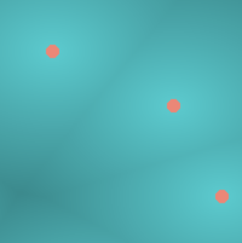</a>     |<a href="/examples/pharmacy-deserts.ipynb">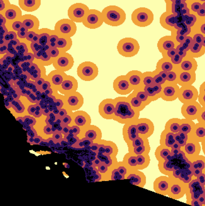</a>|
|<a href="/examples/user_guide/1_Surface.ipynb">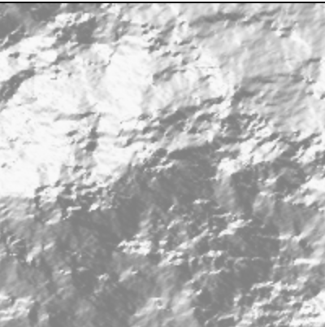</a> | <a href="/examples/user_guide/1_Surface.ipynb">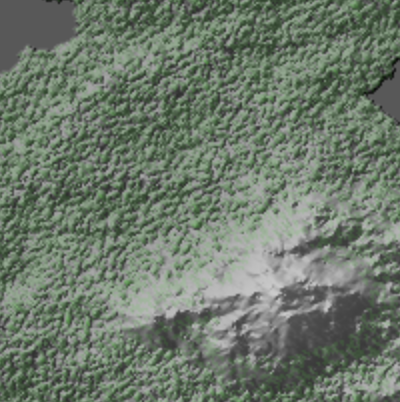</a>       |<a href="/examples/user_guide/1_Surface.ipynb">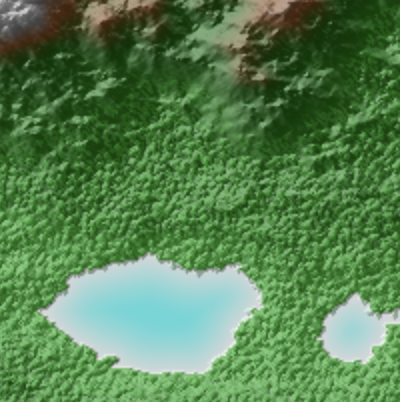</a>       |<a href="/examples/user_guide/1_Surface.ipynb">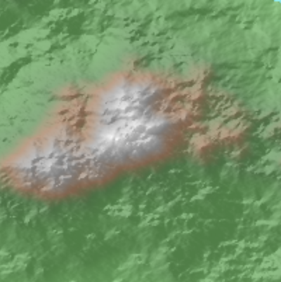</a>       |<a href="/examples/pharmacy-deserts.ipynb">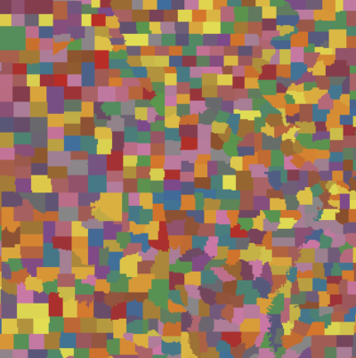</a>|
|<a href="/examples/user_guide/1_Surface.ipynb">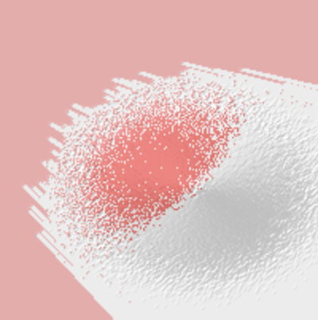</a> | <a href="/examples/user_guide/8_Remote_Sensing.ipynb">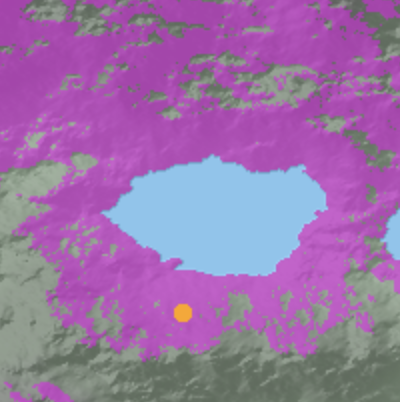</a>|<a href="/examples/user_guide/8_Remote_Sensing.ipynb">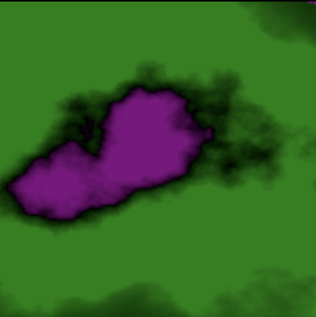</a>|<a href="/examples/user_guide/5_Classification.ipynb">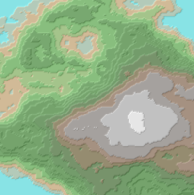</a>|<a href="/examples/pharmacy-deserts.ipynb">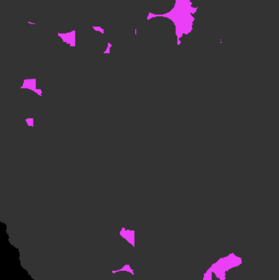</a>|
|<a href="/examples/">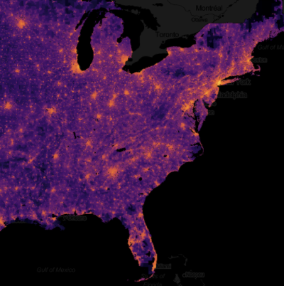</a>                           | <a href="/examples/">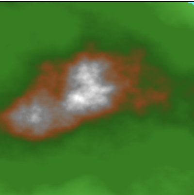</a>                                 |<a href="/examples/user_guide/5_Classification.ipynb">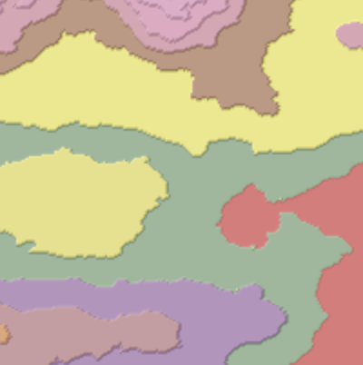</a>|<a href="/examples/pharmacy-deserts.ipynb">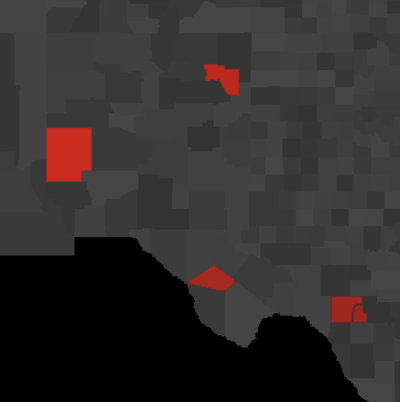</a>|<a href="/examples/">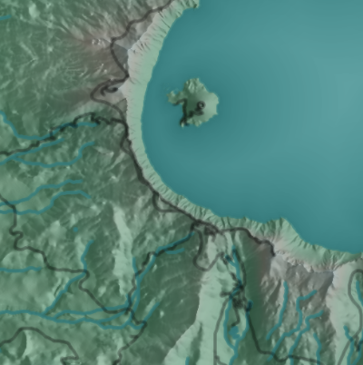</a>|
|<a href="/examples/Pathfinding_Austin_Road_Network.ipynb">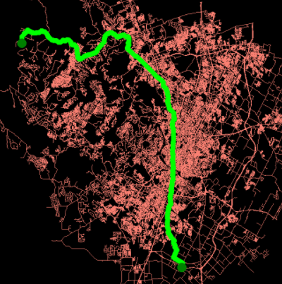</a> |<a href="/examples/user_guide/1_Surface.ipynb#Hillshade">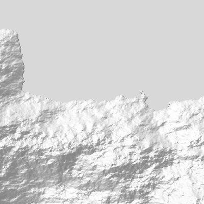</a> | <a href="/examples/user_guide/1_Surface.ipynb#Hillshade">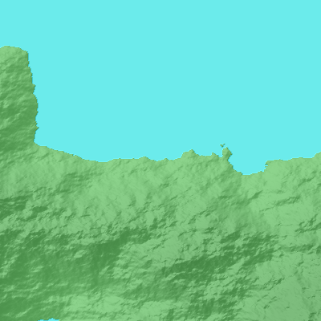</a>| <a href="/examples/user_guide/1_Surface.ipynb#Slope">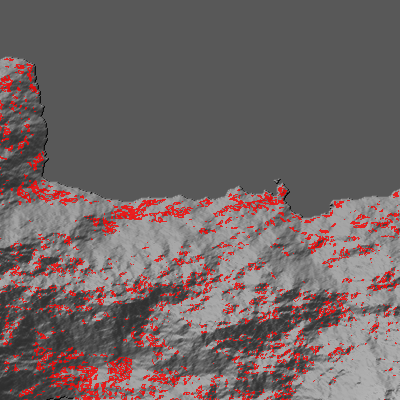</a>| <a href="/examples/pharmacy-deserts.ipynb#Create-a-%22Distance-to-Nearest-Pharmacy%22-Layer-&-Classify-into-5-Groups">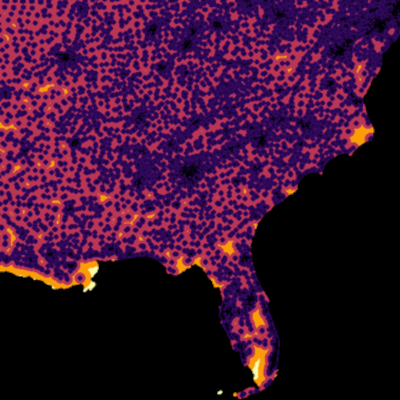</a>|


`xarray-spatial` grew out of the [Datashader project](https://datashader.org/), which provides fast rasterization of vector data (points, lines, polygons, meshes, and rasters) for use with xarray-spatial.

`xarray-spatial` does not depend on GDAL / GEOS, which makes it fully extensible in Python but does limit the breadth of operations that can be covered.  xarray-spatial is meant to include the core raster-analysis functions needed for GIS developers / analysts, implemented independently of the non-Python geo stack.

Our documentation is still under construction, but [docs can be found here](https://xarray-spatial.readthedocs.io/en/latest/).

#### Raster-huh?

Rasters are regularly gridded datasets like GeoTIFFs, JPGs, and PNGs.

In the GIS world, rasters are used for representing continuous phenomena (e.g. elevation, rainfall, distance), either directly as numerical values, or as RGB images created for humans to view. Rasters typically have two spatial dimensions, but may have any number of other dimensions (time, type of measurement, etc.)

#### Supported Spatial Functions with Supported Inputs

-------

### **Classification**

| Name | NumPy xr.DataArray | Dask xr.DataArray | CuPy GPU xr.DataArray | Dask GPU xr.DataArray |
|:----------:|:----------------------:|:--------------------:|:-------------------:|:------:|
| [Equal Interval](xrspatial/classify.py) |✅️ |✅ | ✅ | ️ |
| [Natural Breaks](xrspatial/classify.py) |✅️ |  |  | ️ |
| [Reclassify](xrspatial/classify.py) |✅️ |✅ | ✅ |✅ |
| [Quantile](xrspatial/classify.py) |✅️ | ✅ |✅ |  ️|

-------

### **Focal**

| Name | NumPy xr.DataArray | Dask xr.DataArray | CuPy GPU xr.DataArray | Dask GPU xr.DataArray |
|:----------:|:----------------------:|:--------------------:|:-------------------:|:------:|
| [Apply](xrspatial/focal.py) | ✅️ | ✅️ |  |  |
| [Hotspots](xrspatial/focal.py) | ✅️ | ✅️ | ✅️ |  |
| [Mean](xrspatial/focal.py) | ✅️ | ✅️ | ✅️ | |
| [Focal Statistics](xrspatial/focal.py) | ✅️ | ✅️ | ✅️ | |

-------

### **Multispectral**

| Name | NumPy xr.DataArray | Dask xr.DataArray | CuPy GPU xr.DataArray | Dask GPU xr.DataArray |
|:----------:|:----------------------:|:--------------------:|:-------------------:|:------:|
| [Atmospherically Resistant Vegetation Index (ARVI)](xrspatial/multispectral.py) | ✅️ |✅️ | ✅️ |✅️ |
| [Enhanced Built-Up and Bareness Index (EBBI)](xrspatial/multispectral.py) | ✅️ |✅️  | ✅️ |✅️ |
| [Enhanced Vegetation Index (EVI)](xrspatial/multispectral.py) | ✅️ |✅️ | ✅️ |✅️ |
| [Green Chlorophyll Index (GCI)](xrspatial/multispectral.py) | ✅️ |✅️ | ✅️ |✅️ |
| [Normalized Burn Ratio (NBR)](xrspatial/multispectral.py) | ✅️ |✅️ | ✅️ |✅️ |
| [Normalized Burn Ratio 2 (NBR2)](xrspatial/multispectral.py) | ✅️ |✅️ | ✅️ |✅️ |
| [Normalized Difference Moisture Index (NDMI)](xrspatial/multispectral.py) | ✅️ |✅️ | ✅️ |✅️ |
| [Normalized Difference Vegetation Index (NDVI)](xrspatial/multispectral.py) | ✅️ |✅️ | ✅️ |✅️ |
| [Soil Adjusted Vegetation Index (SAVI)](xrspatial/multispectral.py) | ✅️ |✅️ | ✅️ |✅️ |
| [Structure Insensitive Pigment Index (SIPI)](xrspatial/multispectral.py) | ✅️ |✅️ | ✅️ |✅️ |
| [True Color](xrspatial/multispectral.py) | ✅️ | ️ | ✅️ | ️ |

-------


### **Pathfinding**

| Name | NumPy xr.DataArray | Dask xr.DataArray | CuPy GPU xr.DataArray | Dask GPU xr.DataArray |
|:----------:|:----------------------:|:--------------------:|:-------------------:|:------:|
| [A* Pathfinding](xrspatial/pathfinding.py) | ✅️ |  | | |

----------

### **Proximity**

| Name | NumPy xr.DataArray | Dask xr.DataArray | CuPy GPU xr.DataArray | Dask GPU xr.DataArray |
|:----------:|:----------------------:|:--------------------:|:-------------------:|:------:|
| [Allocation](xrspatial/proximity.py) | ✅️ | ✅ | | |
| [Direction](xrspatial/proximity.py) | ✅️ | ✅ | | |
| [Proximity](xrspatial/proximity.py) | ✅️ | ✅ | | |

--------

### **Raster to vector**

| Name | NumPy xr.DataArray | Dask xr.DataArray | CuPy GPU xr.DataArray | Dask GPU xr.DataArray |
|:-----|:------------------:|:-----------------:|:---------------------:|:---------------------:|
| [Polygonize](xrspatial/experimental/polygonize.py) | ✅️ | | | |

--------

### **Surface**

| Name | NumPy xr.DataArray | Dask xr.DataArray | CuPy GPU xr.DataArray | Dask GPU xr.DataArray |
|:----------:|:----------------------:|:--------------------:|:-------------------:|:------:|
| [Aspect](xrspatial/aspect.py) | ✅️ | ✅️ | ✅️ | ⚠️ |
| [Curvature](xrspatial/curvature.py) | ✅️ | | | ⚠️  |
| [Hillshade](xrspatial/hillshade.py) | ✅️ | ✅️  | | |
| [Slope](xrspatial/slope.py) | ✅️  | ✅️  | ✅️ | ⚠️  |
| [Terrain Generation](xrspatial/terrain.py) | ✅️ | ✅️ | ✅️ | |
| [Viewshed](xrspatial/viewshed.py) | ✅️ |  | | |
| [Perlin Noise](xrspatial/perlin.py) | ✅️ | ✅️ | ✅️ | |
| [Bump Mapping](xrspatial/bump.py) | ✅️ | | | |

-----------

### **Zonal**

| Name | NumPy xr.DataArray | Dask xr.DataArray | CuPy GPU xr.DataArray | Dask GPU xr.DataArray |
|:----------:|:----------------------:|:--------------------:|:-------------------:|:------:|
| [Apply](xrspatial/zonal.py) | ✅️ | ✅️ | | |
| [Crop](xrspatial/zonal.py) | ✅️ | | | |
| [Regions](xrspatial/zonal.py) |  |  | | |
| [Trim](xrspatial/zonal.py) | ✅️ |  | | |
| [Zonal Statistics](xrspatial/zonal.py) | ✅️ | ✅️| | |
| [Zonal Cross Tabulate](xrspatial/zonal.py) | ✅️ | ✅️| | |

-----------

### **Local**

| Name | NumPy xr.DataArray | Dask xr.DataArray | CuPy GPU xr.DataArray | Dask GPU xr.DataArray |
|:----------:|:----------------------:|:--------------------:|:-------------------:|:------:|
| [Cell Stats](xrspatial/local.py) | ✅️ |  | | |
| [Combine](xrspatial/local.py) | ✅️ | | | |
| [Lesser Frequency](xrspatial/local.py) | ✅️ |  | | |
| [Equal Frequency](xrspatial/local.py) | ✅️ |  | | |
| [Greater Frequency](xrspatial/local.py) | ✅️ |  | | |
| [Lowest Position](xrspatial/local.py) | ✅️ | | | |
| [Highest Position](xrspatial/local.py) | ✅️ | | | |
| [Popularity](xrspatial/local.py) | ✅️ | | | |
| [Rank](xrspatial/local.py) | ✅️ | | | |

#### Usage

##### Basic Pattern
```python
import xarray as xr
from xrspatial import hillshade

my_dataarray = xr.DataArray(...)
hillshaded_dataarray = hillshade(my_dataarray)
```

Check out the user guide [here](/examples/user_guide/).

------


#### Dependencies

`xarray-spatial` currently depends on Datashader, but will soon be updated to depend only on `xarray` and `numba`, while still being able to make use of Datashader output when available.

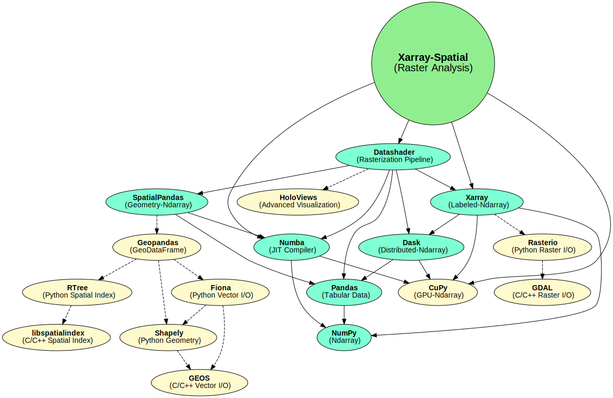

#### Notes on GDAL

Within the Python ecosystem, many geospatial libraries interface with the GDAL C++ library for raster and vector input, output, and analysis (e.g. rasterio, rasterstats, geopandas). GDAL is robust, performant, and has decades of great work behind it. For years, off-loading expensive computations to the C/C++ level in this way has been a key performance strategy for Python libraries (obviously...Python itself is implemented in C!).

However, wrapping GDAL has a few drawbacks for Python developers and data scientists:
- GDAL can be a pain to build / install.
- GDAL is hard for Python developers/analysts to extend, because it requires understanding multiple languages.
- GDAL's data structures are defined at the C/C++ level, which constrains how they can be accessed from Python.

With the introduction of projects like Numba, Python gained new ways to provide high-performance code directly in Python, without depending on or being constrained by separate C/C++ extensions. `xarray-spatial` implements algorithms using Numba and Dask, making all of its source code available as pure Python without any "black box" barriers that obscure what is going on and prevent full optimization. Projects can make use of the functionality provided by `xarray-spatial` where available, while still using GDAL where required for other tasks.

#### Citation
Cite our code:

`makepath/xarray-spatial, https://github.com/makepath/xarray-spatial, ©2020-2024.`
