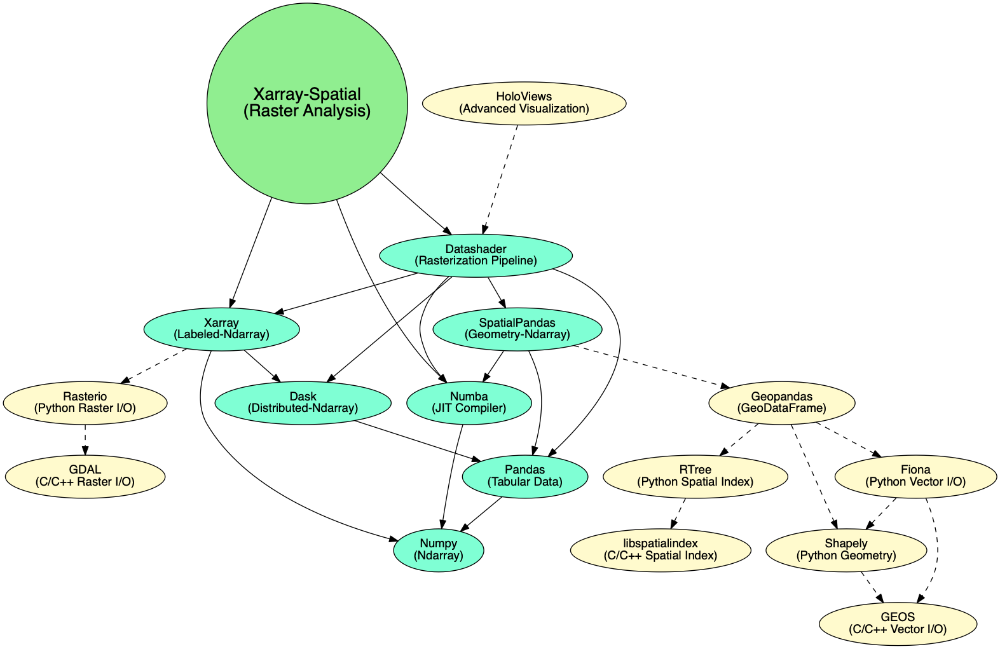

:earth_africa: xarray-spatial: Raster-based Spatial Analysis in Python
-------

[](https://travis-ci.org/makepath/xarray-spatial)
[](https://badge.fury.io/py/xarray-spatial)
-------

-------
:round_pushpin: Fast, Accurate Python library for Raster Operations

:zap: Extensible with [Numba](http://numba.pydata.org/)

:fast_forward: Scalable with [Dask](http://dask.pydata.org)

:confetti_ball: No GDAL / GEOS Dependency

:earth_africa: Geared towards GIS Professionals

-------

`xarray-spatial` implements common raster analysis functions using numba and provides an easy-to-install, easy-to-extend codebase for raster analysis.

`xarray-spatial` is a generalization which fell out of the [datashader project](https://datashader.org/).

`xarray-spatial` does not depend on GDAL / GEOS, and because of this has limited breadth.  The plan is to implement core raster analysis functions in terminology common to GIS developers / analysts.


#### Installation
```bash
# via conda
conda install -c makepath xarray-spatial

# via pip
pip install xarray-spatial
```

#### Raster-huh?

Rasters are regularly gridded datasets like GeoTIFFs, JPGs, and PNGs.

In the GIS world, folks use rasters for representing continuous phenomena (e.g. elevation, rainfall, distance).   

#### Current Spatial Functions:
- [Slope](xrspatial/slope.py)
- [Aspect](xrspatial/aspect.py)
- [Curvature](xrspatial/curvature.py)
- [Hillshade](xrspatial/hillshade.py)
- [Normalized Difference Vegetation Index (NDVI)](xrspatial/ndvi.py)
- [Focal Statistics](xrspatial/focal.py)
- [Zonal Statistics](xrspatial/zonal.py)
- [Zonal Cross Tabulate](xrspatial/zonal.py)
- [Viewshed](xrspatial/viewshed.py)
- [Proximity](xrspatial/proximity.py)
- [Bump Mapping](xrspatial/bump.py)
- [Perlin Noise](xrspatial/perlin.py)
- [Procedural Terrain Generation](xrspatial/terrain.py)

#### Usage

##### Basic Pattern
```python
import xarray as xr
from xrspatial import hillshade

my_dataarray = xr.DataArray(...)
hillshaded_dataarray = hillshade(my_dataarray)
```

Check out the user guide [here](/examples/user-guide.ipynb)

#### Dependencies

`xarray-spatial` currently depends on datashader, which will change in the future to only include `xarray`, `numba`. 



#### Notes on GDAL

Within the Python ecosystem, many geospatial libraries interface with GDAL (C++) for raster input / output and analysis (e.g. rasterio, raster-stats). People wrap GDAL because its robust, performant and has decades of great work behind it. Off-loading expensive computations to the C/C++ level has been a key performance strategy for Python libraries (obviously...Python itself is implemented in C).

Wrapping GDAL has a few drawbacks for Python developers and data scientists:
- GDAL can be a pain to build / install.
- GDAL is hard for Python developers/analysts to extend.

With the introduction of projects like numba, Python gained new ways to improve performance without writing C/C++ extensions. `xarray-spatial` implements algorithmsusing numba and 

#### Contributors

- @brendancol
- @thuydotm
