<table>
<tr>
  <td>Latest Release</td>
  <td>
    <div>
        
        
    </div>
  </td>

  <td>Downloads</td>
  <td>
    <div>
    
    
    </div>
  </td>
</tr>

<tr>
  <td>License</td>
  <td>
    <a href="https://github.com/xarray-contrib/xarray-spatial/blob/master/LICENSE.txt">
    
    </a>
  </td>

  <td>People</td>
  <td>
    
  </td>
</tr>

<tr>
  <td>Build Status</td>
  <td>
    <div>
    <a href="https://github.com/xarray-contrib/xarray-spatial/actions/workflows/test.yml">
    
    </a>
    </div>
    <div>
    <a href="https://github.com/xarray-contrib/xarray-spatial/actions/workflows/pypi-publish.yml">
    
    </a>
    </div>
    <div>
      <a href='https://xarray-spatial.readthedocs.io/en/latest/?badge=latest'>
        
      </a>
    </div>
  </td>
  <td>Coverage</td>
  <td>
    <div>
      <a href="https:https://codecov.io/gh/xarray-contrib/xarray-spatial">
      
      </a>
    </div>
  </td>

</tr>
</table>

-------
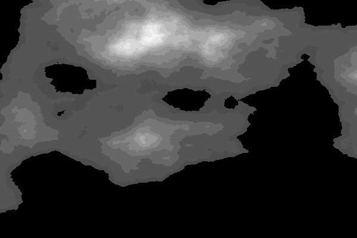
-------
:round_pushpin: Fast, Accurate Python library for Raster Operations

:zap: Extensible with [Numba](http://numba.pydata.org/)

:fast_forward: Scalable with [Dask](http://dask.pydata.org)

:desktop_computer: GPU-accelerated with [CuPy](https://cupy.dev/) and [Numba CUDA](https://numba.readthedocs.io/en/stable/cuda/index.html)

:confetti_ball: Free of GDAL / GEOS Dependencies

:earth_africa: General-Purpose Spatial Processing, Geared Towards GIS Professionals

-------

Xarray-Spatial is a Python library for raster analysis built on xarray. It has 100+ functions for surface analysis, hydrology (D8, D-infinity, MFD), fire behavior, flood modeling, multispectral indices, proximity, classification, pathfinding, and interpolation. Functions dispatch automatically across four backends (NumPy, Dask, CuPy, Dask+CuPy). A built-in GeoTIFF/COG reader and writer handles raster I/O without GDAL.

### Installation
```bash
# via pip
pip install xarray-spatial

# via conda
conda install -c conda-forge xarray-spatial
```

### Downloading our starter examples and data
Once you have xarray-spatial installed in your environment, you can use one of the following in your terminal (with the environment active) to download our examples and/or sample data into your local directory.

```xrspatial examples``` : Download the examples notebooks and the data used.

```xrspatial copy-examples``` : Download the examples notebooks but not the data. Note: you won't be able to run many of the examples.

```xrspatial fetch-data``` : Download just the data and not the notebooks.

In all the above, the command will download and store the files into your current directory inside a folder named 'xrspatial-examples'.


| | | | | |
|:-------------------------:|:-------------------------:|:-------------------------:|:-------------------------:|:-------------------------:|
|<a href="/examples/"></a>                           | <a href="/examples/user_guide/2_Proximity.ipynb">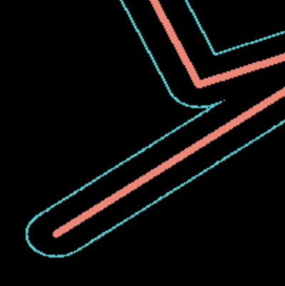</a>     |<a href="/examples/user_guide/2_Proximity.ipynb"></a>     |<a href="/examples/user_guide/2_Proximity.ipynb"></a>     |<a href="/examples/pharmacy-deserts.ipynb">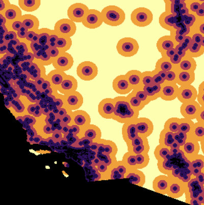</a>|
|<a href="/examples/user_guide/1_Surface.ipynb">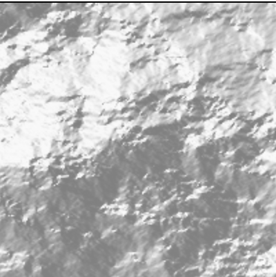</a> | <a href="/examples/user_guide/1_Surface.ipynb">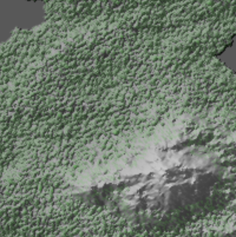</a>       |<a href="/examples/user_guide/1_Surface.ipynb">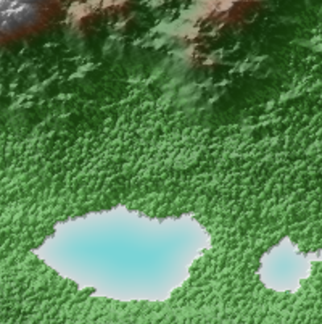</a>       |<a href="/examples/user_guide/1_Surface.ipynb">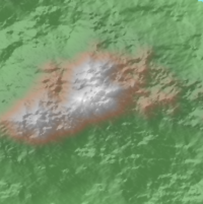</a>       |<a href="/examples/pharmacy-deserts.ipynb">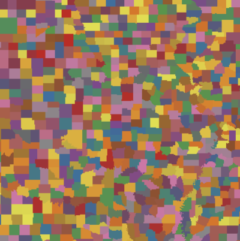</a>|
|<a href="/examples/user_guide/1_Surface.ipynb">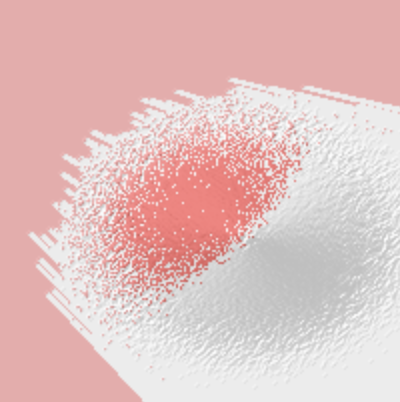</a> | <a href="/examples/user_guide/8_Remote_Sensing.ipynb">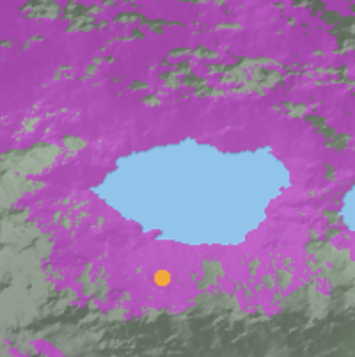</a>|<a href="/examples/user_guide/8_Remote_Sensing.ipynb">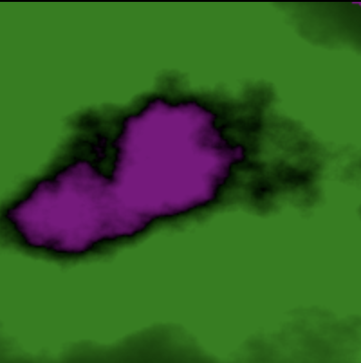</a>|<a href="/examples/user_guide/5_Classification.ipynb">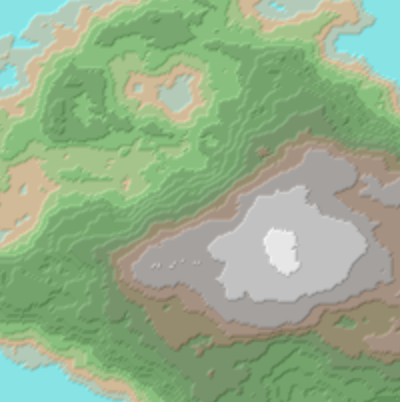</a>|<a href="/examples/pharmacy-deserts.ipynb">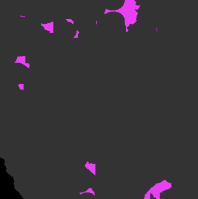</a>|
|<a href="/examples/">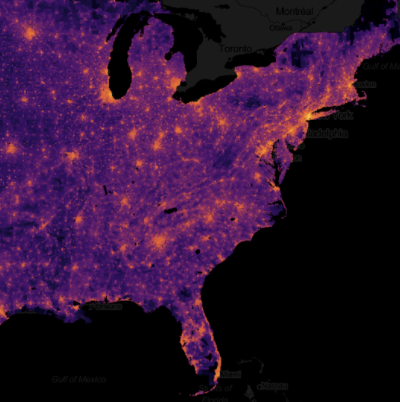</a>                           | <a href="/examples/">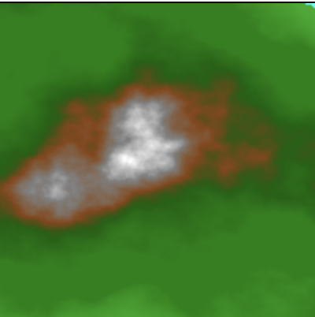</a>                                 |<a href="/examples/user_guide/5_Classification.ipynb">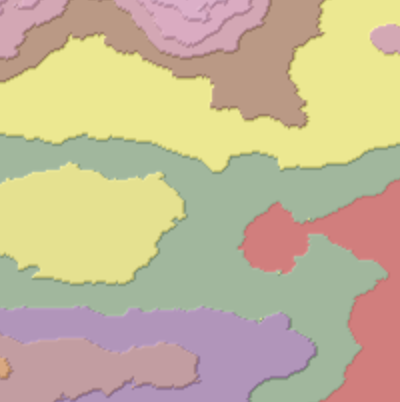</a>|<a href="/examples/pharmacy-deserts.ipynb">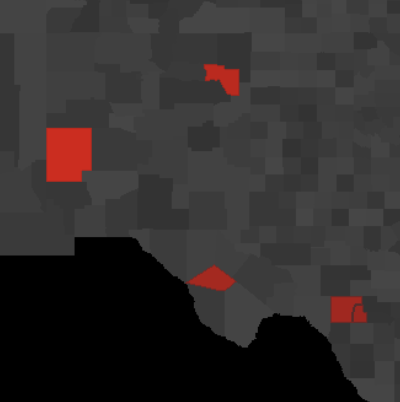</a>|<a href="/examples/">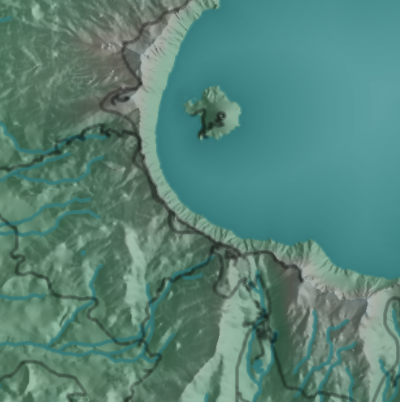</a>|
|<a href="/examples/Pathfinding_Austin_Road_Network.ipynb">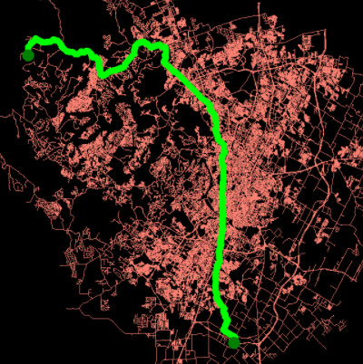</a> |<a href="/examples/user_guide/1_Surface.ipynb#Hillshade">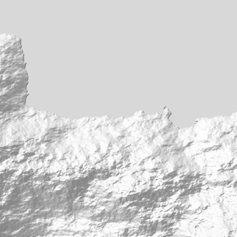</a> | <a href="/examples/user_guide/1_Surface.ipynb#Hillshade">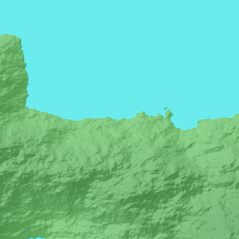</a>| <a href="/examples/user_guide/1_Surface.ipynb#Slope">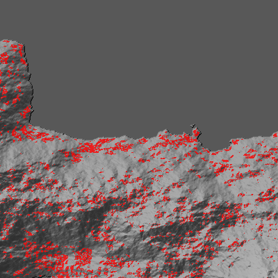</a>| <a href="/examples/pharmacy-deserts.ipynb#Create-a-%22Distance-to-Nearest-Pharmacy%22-Layer-&-Classify-into-5-Groups">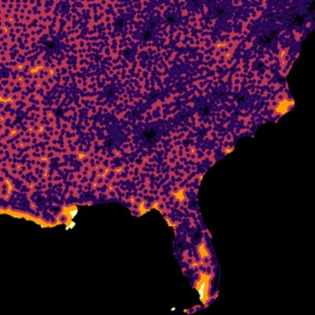</a>|


`xarray-spatial` grew out of the [Datashader project](https://datashader.org/), which provides fast rasterization of vector data (points, lines, polygons, meshes, and rasters) for use with xarray-spatial.

`xarray-spatial` does not depend on GDAL or GEOS. Raster I/O, reprojection, compression codecs, and coordinate handling are all pure Python and Numba -- no C/C++ bindings anywhere in the stack.

[API reference docs](https://xarray-spatial.readthedocs.io/en/latest/) and [33+ user guide notebooks](examples/user_guide/) cover every module.

#### Raster-huh?

Rasters are regularly gridded datasets like GeoTIFFs, JPGs, and PNGs.

In the GIS world, rasters are used for representing continuous phenomena (e.g. elevation, rainfall, distance), either directly as numerical values, or as RGB images created for humans to view. Rasters typically have two spatial dimensions, but may have any number of other dimensions (time, type of measurement, etc.)

#### Supported Spatial Functions with Supported Inputs
✅ = native backend &nbsp;&nbsp; 🔄 = accepted (CPU fallback)

-------
### **GeoTIFF / COG I/O**

Native GeoTIFF and Cloud Optimized GeoTIFF reader/writer. No GDAL required.

| Name | Description | NumPy | Dask | CuPy GPU | Dask+CuPy GPU | Cloud |
|:-----|:------------|:-----:|:----:|:--------:|:-------------:|:-----:|
| [read_geotiff](xrspatial/geotiff/__init__.py) | Read GeoTIFF / COG / VRT | ✅️ | ✅️ | ✅️ | ✅️ | ✅️ |
| [write_geotiff](xrspatial/geotiff/__init__.py) | Write DataArray as GeoTIFF / COG | ✅️ | ✅️ | ✅️ | ✅️ | ✅️ |
| [write_vrt](xrspatial/geotiff/__init__.py) | Generate VRT mosaic from GeoTIFFs | ✅️ | | | | |

`read_geotiff` and `write_geotiff` auto-dispatch to the correct backend:

```python
read_geotiff('dem.tif')                              # NumPy
read_geotiff('dem.tif', chunks=512)                  # Dask
read_geotiff('dem.tif', gpu=True)                    # CuPy (nvCOMP + GDS)
read_geotiff('dem.tif', gpu=True, chunks=512)        # Dask + CuPy
read_geotiff('https://example.com/cog.tif')          # HTTP COG
read_geotiff('s3://bucket/dem.tif')                  # Cloud (S3/GCS/Azure)
read_geotiff('mosaic.vrt')                           # VRT mosaic (auto-detected)

write_geotiff(cupy_array, 'out.tif')                 # auto-detects GPU
write_geotiff(data, 'out.tif', gpu=True)             # force GPU compress
write_vrt('mosaic.vrt', ['tile1.tif', 'tile2.tif'])  # generate VRT
```

**Compression codecs:** Deflate, LZW (Numba JIT), ZSTD, PackBits, JPEG (Pillow), uncompressed

**GPU codecs:** Deflate and ZSTD via nvCOMP batch API; LZW via Numba CUDA kernels

**Features:**
- Tiled, stripped, BigTIFF, multi-band (RGB/RGBA), sub-byte (1/2/4/12-bit)
- Predictors: horizontal differencing (pred=2), floating-point (pred=3)
- GeoKeys: EPSG, WKT/PROJ (via pyproj), citations, units, ellipsoid, vertical CRS
- Metadata: nodata masking, palette colormaps, DPI/resolution, GDALMetadata XML, arbitrary tag preservation
- Cloud storage: S3 (`s3://`), GCS (`gs://`), Azure (`az://`) via fsspec
- GPUDirect Storage: SSD→GPU direct DMA via KvikIO (optional)
- Thread-safe mmap reads, atomic writes, HTTP connection reuse (urllib3)
- Overview generation: mean, nearest, min, max, median, mode, cubic
- Planar config, big-endian byte swap, PixelIsArea/PixelIsPoint

**Read performance** (real-world files, A6000 GPU):

| File | Format | xrspatial CPU | rioxarray | GPU (nvCOMP) |
|:-----|:-------|:------------:|:---------:|:------------:|
| render_demo 187x253 | uncompressed | **0.2ms** | 2.4ms | 0.7ms |
| Landsat B4 1310x1093 | uncompressed | **1.0ms** | 6.0ms | 1.7ms |
| Copernicus 3600x3600 | deflate+fp3 | 241ms | 195ms | 872ms |
| USGS 1as 3612x3612 | LZW+fp3 | 275ms | 215ms | 747ms |
| USGS 1m 10012x10012 | LZW | **1.25s** | 1.80s | **990ms** |

**Read performance** (synthetic tiled, GPU shines at scale):

| Size | Codec | xrspatial CPU | rioxarray | GPU (nvCOMP) |
|:-----|:------|:------------:|:---------:|:------------:|
| 4096x4096 | deflate | 265ms | 211ms | **158ms** |
| 4096x4096 | zstd | **73ms** | 159ms | **58ms** |
| 8192x8192 | deflate | 1.06s | 859ms | **565ms** |
| 8192x8192 | zstd | **288ms** | 668ms | **171ms** |

**Write performance** (synthetic tiled):

| Size | Codec | xrspatial CPU | rioxarray | GPU (nvCOMP) |
|:-----|:------|:------------:|:---------:|:------------:|
| 2048x2048 | deflate | 424ms | 110ms | **135ms** |
| 2048x2048 | zstd | 49ms | 83ms | 81ms |
| 4096x4096 | deflate | 1.68s | 447ms | **302ms** |
| 8192x8192 | deflate | 6.84s | 2.03s | **1.11s** |
| 8192x8192 | zstd | 847ms | 822ms | 1.03s |

**Consistency:** 100% pixel-exact match vs rioxarray on all tested files (Landsat 8, Copernicus DEM, USGS 1-arc-second, USGS 1-meter).

-----------
### **Reproject / Merge**

| Name | Description | Source | NumPy xr.DataArray | Dask xr.DataArray | CuPy GPU xr.DataArray | Dask GPU xr.DataArray |
|:----------:|:------------|:------:|:----------------------:|:--------------------:|:-------------------:|:------:|
| [Reproject](xrspatial/reproject/__init__.py) | Reprojects a raster to a new CRS with Numba JIT / CUDA coordinate transforms and resampling | Standard (inverse mapping) | ✅️ | ✅️ | ✅️ | ✅️ |
| [Merge](xrspatial/reproject/__init__.py) | Merges multiple rasters into a single mosaic with configurable overlap strategy | Standard (mosaic) | ✅️ | ✅️ | 🔄 | 🔄 |

Built-in Numba JIT and CUDA projection kernels bypass pyproj for common CRS pairs:

| Projection | EPSG examples | CPU Numba | CUDA GPU |
|:-----------|:-------------|:---------:|:--------:|
| Web Mercator | 3857 | ✅️ | ✅️ |
| UTM (Transverse Mercator, Krueger 6th-order) | 326xx, 327xx, 269xx | ✅️ | ✅️ |
| Ellipsoidal Mercator | 3395 | ✅️ | ✅️ |
| Lambert Conformal Conic | 2154, State Plane | ✅️ | ✅️ |
| Albers Equal Area | 5070 | ✅️ | ✅️ |
| Cylindrical Equal Area | 6933 | ✅️ | ✅️ |
| Sinusoidal | MODIS grids | ✅️ | |
| Lambert Azimuthal Equal Area | 3035, 6931, 6932 | ✅️ | |
| Polar Stereographic | 3031, 3413, 3996 | ✅️ | |

Other CRS pairs fall back to pyproj automatically.

**Coordinate transform performance** (4096x4096 = 16.8M pixels, coordinate transform only):

| Projection | Numba | pyproj | Speedup |
|:---|---:|---:|---:|
| Web Mercator | 144ms | 853ms | **5.9x** |
| UTM zone 33N | 222ms | 1.77s | **8.0x** |
| Ell. Mercator | 278ms | 2.63s | **9.5x** |
| LCC France | 331ms | 3.02s | **9.1x** |
| Albers CONUS | 172ms | 1.27s | **7.4x** |
| CEA EASE-Grid | 150ms | 852ms | **5.7x** |
| Sinusoidal (MODIS) | 194ms | 1.01s | **5.2x** |
| LAEA Europe | 194ms | 1.64s | **8.5x** |
| Polar Stere Antarctic | 384ms | 3.64s | **9.5x** |
| Polar Stere Arctic | 362ms | 3.86s | **10.7x** |
| State Plane ME (tmerc) | 222ms | 2.02s | **9.1x** |
| State Plane CA (lcc, ftUS) | 443ms | 4.51s | **10.2x** |

The Numba kernels port the actual PROJ math (Krueger 6th-order series for Transverse Mercator, Newton iteration for LCC/Mercator inverse, authalic latitude Fourier series for equal-area projections) to `@njit(parallel=True)`. GPU CUDA variants of the first six projections run 40-165x faster than pyproj (5-35ms for 16.8M pixels on an A6000).

These times measure the coordinate transform alone. Total `reproject()` time also includes resampling (bilinear/cubic interpolation), which adds roughly the same amount again. CRS pairs not in the table go through pyproj automatically -- the resampling kernel is the same either way.

-------

### **Utilities**

| Name | Description | Source | NumPy xr.DataArray | Dask xr.DataArray | CuPy GPU xr.DataArray | Dask GPU xr.DataArray |
|:----------:|:------------|:------:|:----------------------:|:--------------------:|:-------------------:|:------:|
| [Preview](xrspatial/preview.py) | Downsamples a raster to target pixel dimensions for visualization | Custom | ✅️ | ✅️ | ✅️ | 🔄 |
| [Rescale](xrspatial/normalize.py) | Min-max normalization to a target range (default [0, 1]) | Standard | ✅️ | ✅️ | ✅️ | ✅️ |
| [Standardize](xrspatial/normalize.py) | Z-score normalization (subtract mean, divide by std) | Standard | ✅️ | ✅️ | ✅️ | ✅️ |

-----------

### **Surface**

| Name | Description | Source | NumPy xr.DataArray | Dask xr.DataArray | CuPy GPU xr.DataArray | Dask GPU xr.DataArray |
|:----------:|:------------|:------:|:----------------------:|:--------------------:|:-------------------:|:------:|
| [Aspect](xrspatial/aspect.py) | Computes downslope direction of each cell in degrees | Horn 1981 | ✅️ | ✅️ | ✅️ | ✅️ |
| [Curvature](xrspatial/curvature.py) | Measures rate of slope change (concavity/convexity) at each cell | Zevenbergen & Thorne 1987 | ✅️ |✅️ |✅️ | ✅️  |
| [Hillshade](xrspatial/hillshade.py) | Simulates terrain illumination from a given sun angle and azimuth | GDAL gdaldem | ✅️ | ✅️ | ✅️ | ✅️ |
| [Roughness](xrspatial/terrain_metrics.py) | Computes local relief as max minus min elevation in a 3×3 window | GDAL gdaldem | ✅️ | ✅️ | ✅️ | ✅️ |
| [Sky-View Factor](xrspatial/sky_view_factor.py) | Measures the fraction of visible sky hemisphere at each cell | Zakek et al. 2011 | ✅️ | ✅️ | ✅️ | ✅️ |
| [Slope](xrspatial/slope.py) | Computes terrain gradient steepness at each cell in degrees | Horn 1981 | ✅️  | ✅️  | ✅️ | ✅️  |
| [Terrain Generation](xrspatial/terrain.py) | Generates synthetic terrain from fBm or ridged fractal noise with optional domain warping, Worley blending, and hydraulic erosion | Custom (fBm) | ✅️ | ✅️ | ✅️ | ✅️ |
| [TPI](xrspatial/terrain_metrics.py) | Computes Topographic Position Index (center minus mean of neighbors) | Weiss 2001 | ✅️ | ✅️ | ✅️ | ✅️ |
| [TRI](xrspatial/terrain_metrics.py) | Computes Terrain Ruggedness Index (local elevation variation) | Riley et al. 1999 | ✅️ | ✅️ | ✅️ | ✅️ |
| [Landforms](xrspatial/terrain_metrics.py) | Classifies terrain into 10 landform types using the Weiss (2001) TPI scheme | Weiss 2001 | ✅️ | ✅️ | ✅️ | ✅️ |
| [Viewshed](xrspatial/viewshed.py) | Determines visible cells from a given observer point on terrain | GRASS GIS r.viewshed | ✅️ | ✅️ | ✅️ | ✅️ |
| [Min Observable Height](xrspatial/experimental/min_observable_height.py) | Finds the minimum observer height needed to see each cell *(experimental)* | Custom | ✅️ | | | |
| [Perlin Noise](xrspatial/perlin.py) | Generates smooth continuous random noise for procedural textures | Perlin 1985 | ✅️ | ✅️ | ✅️ | ✅️ |
| [Worley Noise](xrspatial/worley.py) | Generates cellular (Voronoi) noise returning distance to the nearest feature point | Worley 1996 | ✅️ | ✅️ | ✅️ | ✅️ |
| [Hydraulic Erosion](xrspatial/erosion.py) | Simulates particle-based water erosion to carve valleys and deposit sediment | Custom | ✅️ | ✅️ | ✅️ | ✅️ |
| [Bump Mapping](xrspatial/bump.py) | Adds randomized bump features to simulate natural terrain variation | Custom | ✅️ | ✅️ | ✅️ | ✅️ |

-----------

### **Hydrology**

| Name | Description | Source | NumPy xr.DataArray | Dask xr.DataArray | CuPy GPU xr.DataArray | Dask GPU xr.DataArray |
|:----------:|:------------|:------:|:----------------------:|:--------------------:|:-------------------:|:------:|
| [Flow Direction (D8)](xrspatial/flow_direction.py) | Computes D8 flow direction from each cell toward the steepest downhill neighbor | O'Callaghan & Mark 1984 | ✅️ | ✅️ | ✅️ | ✅️ |
| [Flow Direction (Dinf)](xrspatial/flow_direction_dinf.py) | Computes D-infinity flow direction as a continuous angle toward the steepest downslope facet | Tarboton 1997 | ✅️ | ✅️ | ✅️ | ✅️ |
| [Flow Direction (MFD)](xrspatial/flow_direction_mfd.py) | Partitions flow to all downslope neighbors with an adaptive exponent (Qin et al. 2007) | Qin et al. 2007 | ✅️ | ✅️ | ✅️ | ✅️ |
| [Flow Accumulation (D8)](xrspatial/flow_accumulation.py) | Counts upstream cells draining through each cell in a D8 flow direction grid | Jenson & Domingue 1988 | ✅️ | ✅️ | ✅️ | ✅️ |
| [Flow Accumulation (Dinf)](xrspatial/flow_accumulation_dinf.py) | Accumulates upstream area by splitting flow proportionally between two neighbors (Tarboton 1997) | Tarboton 1997 | ✅️ | ✅️ | ✅️ | 🔄 |
| [Flow Accumulation (MFD)](xrspatial/flow_accumulation_mfd.py) | Accumulates upstream area through all MFD flow paths weighted by directional fractions | Qin et al. 2007 | ✅️ | ✅️ | ✅️ | 🔄 |
| [Flow Length (D8)](xrspatial/flow_length.py) | Computes D8 flow path length from each cell to outlet (downstream) or from divide (upstream) | Standard (D8 tracing) | ✅️ | ✅️ | ✅️ | 🔄 |
| [Flow Length (Dinf)](xrspatial/flow_length_dinf.py) | Proportion-weighted flow path length using D-inf angle decomposition (downstream or upstream) | Tarboton 1997 | ✅️ | ✅️ | ✅️ | 🔄 |
| [Flow Length (MFD)](xrspatial/flow_length_mfd.py) | Proportion-weighted flow path length using MFD fractions (downstream or upstream) | Qin et al. 2007 | ✅️ | ✅️ | ✅️ | 🔄 |
| [Watershed](xrspatial/watershed.py) | Labels each cell with the pour point it drains to via D8 flow direction | Standard (D8 tracing) | ✅️ | ✅️ | ✅️ | ✅️ |
| [Basins](xrspatial/watershed.py) | Delineates drainage basins by labeling each cell with its outlet ID | Standard (D8 tracing) | ✅️ | ✅️ | ✅️ | ✅️ |
| [Stream Order](xrspatial/stream_order.py) | Assigns Strahler or Shreve stream order to cells in a drainage network | Strahler 1957, Shreve 1966 | ✅️ | ✅️ | ✅️ | ✅️ |
| [Stream Order (Dinf)](xrspatial/stream_order_dinf.py) | Strahler/Shreve stream ordering on D-infinity flow direction grids | Tarboton 1997 | ✅️ | ✅️ | ✅️ | ✅️ |
| [Stream Order (MFD)](xrspatial/stream_order_mfd.py) | Strahler/Shreve stream ordering on MFD fraction grids | Freeman 1991 | ✅️ | ✅️ | ✅️ | ✅️ |
| [Stream Link](xrspatial/stream_link.py) | Assigns unique IDs to each stream segment between junctions | Standard | ✅️ | ✅️ | ✅️ | ✅️ |
| [Stream Link (Dinf)](xrspatial/stream_link_dinf.py) | Stream link segmentation on D-infinity flow direction grids | Tarboton 1997 | ✅️ | ✅️ | ✅️ | ✅️ |
| [Stream Link (MFD)](xrspatial/stream_link_mfd.py) | Stream link segmentation on MFD fraction grids | Freeman 1991 | ✅️ | ✅️ | ✅️ | ✅️ |
| [Snap Pour Point](xrspatial/snap_pour_point.py) | Snaps pour points to the highest-accumulation cell within a search radius | Custom | ✅️ | ✅️ | ✅️ | ✅️ |
| [Flow Path](xrspatial/flow_path.py) | Traces downstream flow paths from start points through a D8 direction grid | Standard (D8 tracing) | ✅️ | ✅️ | 🔄 | 🔄 |
| [HAND](xrspatial/hand.py) | Computes Height Above Nearest Drainage by tracing D8 flow to the nearest stream cell | Nobre et al. 2011 | ✅️ | ✅️ | 🔄 | 🔄 |
| [TWI](xrspatial/twi.py) | Topographic Wetness Index: ln(specific catchment area / tan(slope)) | Beven & Kirkby 1979 | ✅️ | ✅️ | ✅️ | 🔄 |

-----------

### **Flood**

| Name | Description | Source | NumPy xr.DataArray | Dask xr.DataArray | CuPy GPU xr.DataArray | Dask GPU xr.DataArray |
|:----------:|:------------|:------:|:----------------------:|:--------------------:|:-------------------:|:------:|
| [Flood Depth](xrspatial/flood.py) | Computes water depth above terrain from a HAND raster and water level | Standard (HAND-based) | ✅️ | ✅️ | ✅️ | ✅️ |
| [Inundation](xrspatial/flood.py) | Produces a binary flood/no-flood mask from a HAND raster and water level | Standard (HAND-based) | ✅️ | ✅️ | ✅️ | ✅️ |
| [Curve Number Runoff](xrspatial/flood.py) | Estimates runoff depth from rainfall using the SCS/NRCS curve number method | SCS/NRCS | ✅️ | ✅️ | ✅️ | ✅️ |
| [Travel Time](xrspatial/flood.py) | Estimates overland flow travel time via simplified Manning's equation | Manning 1891 | ✅️ | ✅️ | ✅️ | ✅️ |
| [Vegetation Roughness](xrspatial/flood.py) | Derives Manning's roughness coefficients from NLCD land cover or NDVI | SCS/NRCS | ✅️ | ✅️ | ✅️ | ✅️ |
| [Vegetation Curve Number](xrspatial/flood.py) | Derives SCS curve numbers from land cover and hydrologic soil group | SCS/NRCS | ✅️ | ✅️ | ✅️ | ✅️ |
| [Flood Depth (Vegetation)](xrspatial/flood.py) | Manning-based steady-state flow depth incorporating vegetation roughness | Manning 1891 | ✅️ | ✅️ | ✅️ | ✅️ |

-----------

### **Multispectral**

| Name | Description | Source | NumPy xr.DataArray | Dask xr.DataArray | CuPy GPU xr.DataArray | Dask GPU xr.DataArray |
|:----------:|:------------|:------:|:----------------------:|:--------------------:|:-------------------:|:------:|
| [Atmospherically Resistant Vegetation Index (ARVI)](xrspatial/multispectral.py) | Vegetation index resistant to atmospheric effects using blue band correction | Kaufman & Tanre 1992 | ✅️ |✅️ | ✅️ |✅️ |
| [Enhanced Built-Up and Bareness Index (EBBI)](xrspatial/multispectral.py) | Highlights built-up areas and barren land from thermal and SWIR bands | As-syakur et al. 2012 | ✅️ |✅️  | ✅️ |✅️ |
| [Enhanced Vegetation Index (EVI)](xrspatial/multispectral.py) | Enhanced vegetation index reducing soil and atmospheric noise | Huete et al. 2002 | ✅️ |✅️ | ✅️ |✅️ |
| [Green Chlorophyll Index (GCI)](xrspatial/multispectral.py) | Estimates leaf chlorophyll content from green and NIR reflectance | Gitelson et al. 2003 | ✅️ |✅️ | ✅️ |✅️ |
| [Normalized Burn Ratio (NBR)](xrspatial/multispectral.py) | Measures burn severity using NIR and SWIR band difference | USGS Landsat | ✅️ |✅️ | ✅️ |✅️ |
| [Normalized Burn Ratio 2 (NBR2)](xrspatial/multispectral.py) | Refines burn severity mapping using two SWIR bands | USGS Landsat | ✅️ |✅️ | ✅️ |✅️ |
| [Normalized Difference Moisture Index (NDMI)](xrspatial/multispectral.py) | Detects vegetation moisture stress from NIR and SWIR reflectance | USGS Landsat | ✅️ |✅️ | ✅️ |✅️ |
| [Normalized Difference Water Index (NDWI)](xrspatial/multispectral.py) | Maps open water bodies using green and NIR band difference | McFeeters 1996 | ✅️ |✅️ | ✅️ |✅️ |
| [Modified Normalized Difference Water Index (MNDWI)](xrspatial/multispectral.py) | Detects water in urban areas using green and SWIR bands | Xu 2006 | ✅️ |✅️ | ✅️ |✅️ |
| [Normalized Difference Vegetation Index (NDVI)](xrspatial/multispectral.py) | Quantifies vegetation density from red and NIR band difference | Rouse et al. 1973 | ✅️ |✅️ | ✅️ |✅️ |
| [Soil Adjusted Vegetation Index (SAVI)](xrspatial/multispectral.py) | Vegetation index with soil brightness correction factor | Huete 1988 | ✅️ |✅️ | ✅️ |✅️ |
| [Structure Insensitive Pigment Index (SIPI)](xrspatial/multispectral.py) | Estimates carotenoid-to-chlorophyll ratio for plant stress detection | Penuelas et al. 1995 | ✅️ |✅️ | ✅️ |✅️ |
| [True Color](xrspatial/multispectral.py) | Composites red, green, and blue bands into a natural color image | Standard | ✅️ | ✅️ | ✅️ | ✅️ |

-------


### **Classification**

| Name | Description | Source | NumPy xr.DataArray | Dask xr.DataArray | CuPy GPU xr.DataArray | Dask GPU xr.DataArray |
|:----------:|:------------|:------:|:----------------------:|:--------------------:|:-------------------:|:------:|
| [Box Plot](xrspatial/classify.py) | Classifies values into bins based on box plot quartile boundaries | PySAL mapclassify | ✅️ |✅ | ✅ | 🔄 |
| [Equal Interval](xrspatial/classify.py) | Divides the value range into equal-width bins | PySAL mapclassify | ✅️ |✅ | ✅ |✅ |
| [Head/Tail Breaks](xrspatial/classify.py) | Classifies heavy-tailed distributions using recursive mean splitting | PySAL mapclassify | ✅️ |✅ | 🔄 | 🔄 |
| [Maximum Breaks](xrspatial/classify.py) | Finds natural groupings by maximizing differences between sorted values | PySAL mapclassify | ✅️ |✅ | 🔄 | 🔄 |
| [Natural Breaks](xrspatial/classify.py) | Optimizes class boundaries to minimize within-class variance (Jenks) | Jenks 1967, PySAL | ✅️ |✅ | 🔄 | 🔄 |
| [Percentiles](xrspatial/classify.py) | Assigns classes based on user-defined percentile breakpoints | PySAL mapclassify | ✅️ |✅ | ✅ | 🔄 |
| [Quantile](xrspatial/classify.py) | Distributes values into classes with equal observation counts | PySAL mapclassify | ✅️ |✅ | ✅ | 🔄 |
| [Reclassify](xrspatial/classify.py) | Remaps pixel values to new classes using a user-defined lookup | PySAL mapclassify | ✅️ |✅ | ✅ |✅ |
| [Std Mean](xrspatial/classify.py) | Classifies values by standard deviation intervals from the mean | PySAL mapclassify | ✅️ |✅ | ✅ |✅ |

-------

### **Focal**

| Name | Description | Source | NumPy xr.DataArray | Dask xr.DataArray | CuPy GPU xr.DataArray | Dask GPU xr.DataArray |
|:----------:|:------------|:------:|:----------------------:|:--------------------:|:-------------------:|:------:|
| [Apply](xrspatial/focal.py) | Applies a custom function over a sliding neighborhood window | Standard | ✅️ | ✅️ | ✅️ | ✅️ |
| [Hotspots](xrspatial/focal.py) | Identifies statistically significant spatial clusters using Getis-Ord Gi* | Getis & Ord 1992 | ✅️ | ✅️ | ✅️ | ✅️ |
| [Emerging Hotspots](xrspatial/emerging_hotspots.py) | Classifies time-series hot/cold spot trends using Gi* and Mann-Kendall | Getis & Ord 1992, Mann 1945 | ✅️ | ✅️ | ✅️ | ✅️ |
| [Mean](xrspatial/focal.py) | Computes the mean value within a sliding neighborhood window | Standard | ✅️ | ✅️ | ✅️ | ✅️ |
| [Focal Statistics](xrspatial/focal.py) | Computes summary statistics over a sliding neighborhood window | Standard | ✅️ | ✅️ | ✅️ | ✅️ |
| [Bilateral](xrspatial/bilateral.py) | Feature-preserving smoothing via bilateral filtering | Tomasi & Manduchi 1998 | ✅️ | ✅️ | ✅️ | ✅️ |
| [GLCM Texture](xrspatial/glcm.py) | Computes Haralick GLCM texture features over a sliding window | Haralick et al. 1973 | ✅️ | ✅️ | 🔄 | 🔄 |

-------

### **Proximity**

| Name | Description | Source | NumPy xr.DataArray | Dask xr.DataArray | CuPy GPU xr.DataArray | Dask GPU xr.DataArray |
|:----------:|:------------|:------:|:----------------------:|:--------------------:|:-------------------:|:------:|
| [Allocation](xrspatial/proximity.py) | Assigns each cell to the identity of the nearest source feature | Standard (Dijkstra) | ✅️ | ✅ | ✅️ | ✅️ |
| [Balanced Allocation](xrspatial/balanced_allocation.py) | Partitions a cost surface into territories of roughly equal cost-weighted area | Custom | ✅️ | ✅ | ✅️ | ✅️ |
| [Cost Distance](xrspatial/cost_distance.py) | Computes minimum accumulated cost to the nearest source through a friction surface | Standard (Dijkstra) | ✅️ | ✅ | ✅️ | ✅️ |
| [Least-Cost Corridor](xrspatial/corridor.py) | Identifies zones of low cumulative cost between two source locations | Standard (Dijkstra) | ✅️ | ✅ | ✅️ | ✅️ |
| [Direction](xrspatial/proximity.py) | Computes the direction from each cell to the nearest source feature | Standard | ✅️ | ✅ | ✅️ | ✅️ |
| [Proximity](xrspatial/proximity.py) | Computes the distance from each cell to the nearest source feature | Standard | ✅️ | ✅ | ✅️ | ✅️ |
| [Surface Distance](xrspatial/surface_distance.py) | Computes distance along the 3D terrain surface to the nearest source | Standard (Dijkstra) | ✅️ | ✅ | ✅️ | ✅️ |
| [Surface Allocation](xrspatial/surface_distance.py) | Assigns each cell to the nearest source by terrain surface distance | Standard (Dijkstra) | ✅️ | ✅ | ✅️ | ✅️ |
| [Surface Direction](xrspatial/surface_distance.py) | Computes compass direction to the nearest source by terrain surface distance | Standard (Dijkstra) | ✅️ | ✅ | ✅️ | ✅️ |

--------

### **Zonal**

| Name | Description | Source | NumPy xr.DataArray | Dask xr.DataArray | CuPy GPU xr.DataArray | Dask GPU xr.DataArray |
|:----------:|:------------|:------:|:----------------------:|:--------------------:|:-------------------:|:------:|
| [Apply](xrspatial/zonal.py) | Applies a custom function to each zone in a classified raster | Standard | ✅️ | ✅️ | ✅️ | ✅️ |
| [Crop](xrspatial/zonal.py) | Extracts the bounding rectangle of a specific zone | Standard | ✅️ | ✅️ | ✅️ | ✅️ |
| [Regions](xrspatial/zonal.py) | Identifies connected regions of non-zero cells | Standard (CCL) | ✅️ | ✅️ | ✅️ | ✅️ |
| [Trim](xrspatial/zonal.py) | Removes nodata border rows and columns from a raster | Standard | ✅️ | ✅️ | ✅️ | ✅️ |
| [Zonal Statistics](xrspatial/zonal.py) | Computes summary statistics for a value raster within each zone | Standard | ✅️ | ✅️| ✅️ | 🔄 |
| [Zonal Cross Tabulate](xrspatial/zonal.py) | Cross-tabulates agreement between two categorical rasters | Standard | ✅️ | ✅️| 🔄 | 🔄 |

-----------

### **Interpolation**

| Name | Description | Source | NumPy xr.DataArray | Dask xr.DataArray | CuPy GPU xr.DataArray | Dask GPU xr.DataArray |
|:----------:|:------------|:------:|:----------------------:|:--------------------:|:-------------------:|:------:|
| [IDW](xrspatial/interpolate/_idw.py) | Inverse Distance Weighting from scattered points to a raster grid | Standard (IDW) | ✅️ | ✅️ | ✅️ | ✅️ |
| [Kriging](xrspatial/interpolate/_kriging.py) | Ordinary Kriging with automatic variogram fitting (spherical, exponential, gaussian) | Standard (ordinary kriging) | ✅️ | ✅️ | ✅️ | ✅️ |
| [Spline](xrspatial/interpolate/_spline.py) | Thin Plate Spline interpolation with optional smoothing | Standard (TPS) | ✅️ | ✅️ | ✅️ | ✅️ |

-----------

### **Morphological**

| Name | Description | Source | NumPy xr.DataArray | Dask xr.DataArray | CuPy GPU xr.DataArray | Dask GPU xr.DataArray |
|:----------:|:------------|:------:|:----------------------:|:--------------------:|:-------------------:|:------:|
| [Erode](xrspatial/morphology.py) | Morphological erosion (local minimum over structuring element) | Standard (morphology) | ✅️ | ✅️ | ✅️ | ✅️ |
| [Dilate](xrspatial/morphology.py) | Morphological dilation (local maximum over structuring element) | Standard (morphology) | ✅️ | ✅️ | ✅️ | ✅️ |
| [Opening](xrspatial/morphology.py) | Erosion then dilation (removes small bright features) | Standard (morphology) | ✅️ | ✅️ | ✅️ | ✅️ |
| [Closing](xrspatial/morphology.py) | Dilation then erosion (fills small dark gaps) | Standard (morphology) | ✅️ | ✅️ | ✅️ | ✅️ |
| [Gradient](xrspatial/morphology.py) | Dilation minus erosion (edge detection) | Standard (morphology) | ✅️ | ✅️ | ✅️ | ✅️ |
| [White Top-hat](xrspatial/morphology.py) | Original minus opening (isolate bright features) | Standard (morphology) | ✅️ | ✅️ | ✅️ | ✅️ |
| [Black Top-hat](xrspatial/morphology.py) | Closing minus original (isolate dark features) | Standard (morphology) | ✅️ | ✅️ | ✅️ | ✅️ |

-------

### **Fire**

| Name | Description | Source | NumPy xr.DataArray | Dask xr.DataArray | CuPy GPU xr.DataArray | Dask GPU xr.DataArray |
|:----------:|:------------|:------:|:----------------------:|:--------------------:|:-------------------:|:------:|
| [dNBR](xrspatial/fire.py) | Differenced Normalized Burn Ratio (pre minus post NBR) | USGS | ✅️ | ✅️ | ✅️ | ✅️ |
| [RdNBR](xrspatial/fire.py) | Relative dNBR normalized by pre-fire vegetation density | USGS | ✅️ | ✅️ | ✅️ | ✅️ |
| [Burn Severity Class](xrspatial/fire.py) | USGS 7-class burn severity from dNBR thresholds | USGS | ✅️ | ✅️ | ✅️ | ✅️ |
| [Fireline Intensity](xrspatial/fire.py) | Byram's fireline intensity from fuel load and spread rate (kW/m) | Byram 1959 | ✅️ | ✅️ | ✅️ | ✅️ |
| [Flame Length](xrspatial/fire.py) | Flame length derived from fireline intensity (m) | Byram 1959 | ✅️ | ✅️ | ✅️ | ✅️ |
| [Rate of Spread](xrspatial/fire.py) | Simplified Rothermel spread rate with Anderson 13 fuel models (m/min) | Rothermel 1972, Anderson 1982 | ✅️ | ✅️ | ✅️ | ✅️ |
| [KBDI](xrspatial/fire.py) | Keetch-Byram Drought Index single time-step update (0-800 mm) | Keetch & Byram 1968 | ✅️ | ✅️ | ✅️ | ✅️ |

-------

### **Raster / Vector Conversion**

| Name | Description | Source | NumPy xr.DataArray | Dask xr.DataArray | CuPy GPU xr.DataArray | Dask GPU xr.DataArray |
|:-----|:------------|:------:|:------------------:|:-----------------:|:---------------------:|:---------------------:|
| [Polygonize](xrspatial/polygonize.py) | Converts contiguous regions of equal value into vector polygons | Standard (CCL) | ✅️ | ✅️ | ✅️ | 🔄 |
| [Contours](xrspatial/contour.py) | Extracts elevation contour lines (isolines) from a raster surface | Standard (marching squares) | ✅️ | ✅️ | 🔄 | 🔄 |
| [Rasterize](xrspatial/rasterize.py) | Rasterizes vector geometries (polygons, lines, points) from a GeoDataFrame | Standard (scanline, Bresenham) | ✅️ | | ✅️ | |

--------

### **Multivariate**

| Name | Description | Source | NumPy xr.DataArray | Dask xr.DataArray | CuPy GPU xr.DataArray | Dask GPU xr.DataArray |
|:----------:|:------------|:------:|:----------------------:|:--------------------:|:-------------------:|:------:|
| [Mahalanobis Distance](xrspatial/mahalanobis.py) | Measures statistical distance from a multi-band reference distribution, accounting for band correlations | Mahalanobis 1936 | ✅️ |✅️ | ✅️ |✅️ |

-------

### **Pathfinding**

| Name | Description | Source | NumPy xr.DataArray | Dask xr.DataArray | CuPy GPU xr.DataArray | Dask GPU xr.DataArray |
|:----------:|:------------|:------:|:----------------------:|:--------------------:|:-------------------:|:------:|
| [A* Pathfinding](xrspatial/pathfinding.py) | Finds the least-cost path between two cells on a cost surface | Hart et al. 1968 | ✅️ | ✅ | 🔄 | 🔄 |
| [Multi-Stop Search](xrspatial/pathfinding.py) | Routes through N waypoints in sequence, with optional TSP reordering | Custom | ✅️ | ✅ | 🔄 | 🔄 |

----------

### **Diffusion**

| Name | Description | Source | NumPy xr.DataArray | Dask xr.DataArray | CuPy GPU xr.DataArray | Dask GPU xr.DataArray |
|:----------:|:------------|:------:|:----------------------:|:--------------------:|:-------------------:|:------:|
| [Diffuse](xrspatial/diffusion.py) | Runs explicit forward-Euler diffusion on a 2D scalar field | Standard (heat equation) | ✅️ | ✅️ | ✅️ | ✅️ |

-------

### **Dasymetric**

| Name | Description | Source | NumPy xr.DataArray | Dask xr.DataArray | CuPy GPU xr.DataArray | Dask GPU xr.DataArray |
|:----------:|:------------|:------:|:----------------------:|:--------------------:|:-------------------:|:------:|
| [Disaggregate](xrspatial/dasymetric.py) | Redistributes zonal totals to pixels using an ancillary weight surface | Mennis 2003 | ✅️ | ✅️ | ✅️ | ✅️ |
| [Pycnophylactic](xrspatial/dasymetric.py) | Tobler's pycnophylactic interpolation preserving zone totals via Laplacian smoothing | Tobler 1979 | ✅️ | | | |

-----------


#### Usage

##### Quick Start

Importing `xrspatial` registers an `.xrs` accessor on DataArrays and Datasets, giving you tab-completable access to every spatial operation:

```python
import xrspatial as xrs
from xrspatial.geotiff import read_geotiff, write_geotiff

# Read a GeoTIFF (no GDAL required)
elevation = read_geotiff('dem.tif')

# Surface analysis
slope = elevation.xrs.slope()
hillshaded = elevation.xrs.hillshade(azimuth=315, angle_altitude=45)
aspect = elevation.xrs.aspect()

# Reproject and write as a Cloud Optimized GeoTIFF
dem_wgs84 = elevation.xrs.reproject(target_crs='EPSG:4326')
write_geotiff(dem_wgs84, 'output.tif', cog=True)

# Classification
classes = elevation.xrs.equal_interval(k=5)
breaks = elevation.xrs.natural_breaks(k=10)

# Proximity
distance = elevation.xrs.proximity(target_values=[1])

# Multispectral
vegetation = nir.xrs.ndvi(red)
enhanced_vi = nir.xrs.evi(red, blue)
```

##### Dataset Support

The `.xrs` accessor works on Datasets too. Single-input functions apply the operation to each data variable. Multi-input functions (multispectral indices) accept string kwargs that map band aliases to variable names:

```python
ds = xr.Dataset({'band_4': red, 'band_5': nir})

# Single-input: slope computed for each variable
slope_ds = ds.xrs.slope()

# Multi-input: map variable names to band parameters
ndvi_result = ds.xrs.ndvi(nir='band_5', red='band_4')
```

##### Function Import Style

All operations are also available as standalone functions:

```python
import xrspatial as xrs

hillshaded = xrs.hillshade(elevation)
slope_result = xrs.slope(elevation)
vegetation = xrs.ndvi(nir, red)
```

Check out the user guide [here](/examples/user_guide/).

------


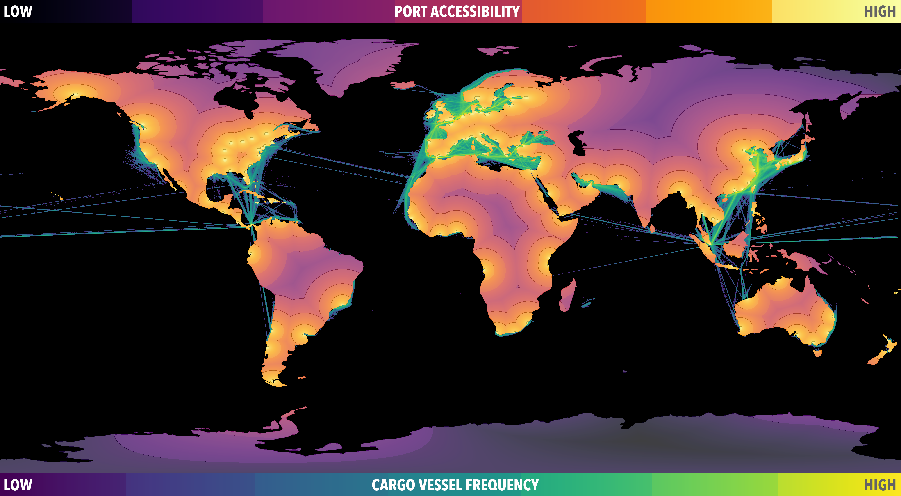

#### Dependencies

**Core:** numpy, numba, scipy, xarray, matplotlib, zstandard

**Optional:**
- `pyproj` — WKT/PROJ CRS resolution
- `cupy` — GPU acceleration
- `dask` — out-of-core processing
- `libnvcomp` — GPU batch decompression (deflate, ZSTD)
- `kvikio` — GPUDirect Storage (SSD → GPU)
- `fsspec` + `s3fs`/`gcsfs`/`adlfs` — cloud storage

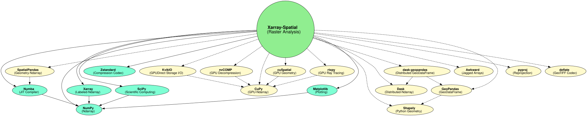

#### Notes on GDAL

`xarray-spatial` does not depend on GDAL. The built-in GeoTIFF/COG reader and writer (`xrspatial.geotiff`) handles raster I/O natively using only numpy, numba, and the standard library. This means:

- **Zero GDAL installation hassle.** `pip install xarray-spatial` gets you everything needed to read and write GeoTIFFs, COGs, and VRT files.
- **Pure Python, fully extensible.** All codec, header parsing, and metadata code is readable Python/Numba, not wrapped C/C++.
- **GPU-accelerated reads.** With optional nvCOMP, compressed tiles decompress directly on the GPU via CUDA -- something GDAL cannot do.

The native reader is pixel-exact against rasterio/GDAL across Landsat 8, Copernicus DEM, USGS 1-arc-second, and USGS 1-meter DEMs. For uncompressed files it reads 5-7x faster than rioxarray; for compressed COGs it is comparable or faster with GPU acceleration.

#### Citation
Cite this code:

`xarray-contrib/xarray-spatial, https://github.com/xarray-contrib/xarray-spatial, ©2020-2026.`
