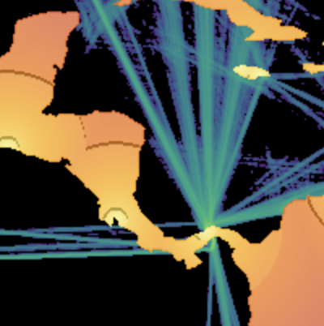

:earth_africa: xarray-spatial: Raster-Based Spatial Analysis in Python
-------

[](https://travis-ci.org/makepath/xarray-spatial)
[](https://ci.appveyor.com/project/brendancol/xarray-spatial)
[](https://badge.fury.io/py/xarray-spatial)
-------

-------
:round_pushpin: Fast, Accurate Python library for Raster Operations

:zap: Extensible with [Numba](http://numba.pydata.org/)

:fast_forward: Scalable with [Dask](http://dask.pydata.org)

:confetti_ball: Free of GDAL / GEOS Dependencies

:earth_africa: General-Purpose Spatial Processing, Geared Towards GIS Professionals

-------

Xarray-Spatial implements common raster analysis functions using Numba and provides an easy-to-install, easy-to-extend codebase for raster analysis.

#### Installation
```bash
# via pip
pip install xarray-spatial

# via conda
conda install -c conda-forge xarray-spatial
```

| | | | | |
|:-------------------------:|:-------------------------:|:-------------------------:|:-------------------------:|:-------------------------:|
|<a href="/examples/user-guide.ipynb"></a> | <a href="/examples/user-guide.ipynb"></a>|<a href="/examples/user-guide.ipynb"></a>|<a href="/examples/user-guide.ipynb"></a>|<a href="/examples/user-guide.ipynb"></a>|
|<a href="/examples/user-guide.ipynb"></a> | <a href="/examples/user-guide.ipynb"></a>|<a href="/examples/user-guide.ipynb"></a>|<a href="/examples/user-guide.ipynb"></a>|<a href="/examples/user-guide.ipynb"></a>|
|<a href="/examples/user-guide.ipynb"></a> | <a href="/examples/user-guide.ipynb"></a>|<a href="/examples/user-guide.ipynb"></a>|<a href="/examples/user-guide.ipynb"></a>|<a href="/examples/user-guide.ipynb"></a>|
|<a href="/examples/user-guide.ipynb"></a> | <a href="/examples/user-guide.ipynb"></a>|<a href="/examples/user-guide.ipynb"></a>|<a href="/examples/user-guide.ipynb"></a>|<a href="/examples/user-guide.ipynb"></a>|
|<a href="/examples/user-guide.ipynb"></a> | | | | |


`xarray-spatial` grew out of the [Datashader project](https://datashader.org/), which provides fast rasterization of vector data (points, lines, polygons, meshes, and rasters) for use with xarray-spatial.

`xarray-spatial` does not depend on GDAL / GEOS, which makes it fully extensible in Python but does limit the breadth of operations that can be covered.  xarray-spatial is meant to include the core raster-analysis functions needed for GIS developers / analysts, implemented independently of the non-Python geo stack.


Our documentation is still under constructions, but [docs can be found here](https://makepath.github.io/xarray-spatial/).


#### Raster-huh?

Rasters are regularly gridded datasets like GeoTIFFs, JPGs, and PNGs.

In the GIS world, rasters are used for representing continuous phenomena (e.g. elevation, rainfall, distance), either directly as numerical values, or as RGB images created for humans to view. Rasters typically have two spatial dimensions, but may have any number of other dimensions (time, type of measurement, etc.)

#### Supported Spatial Functions:
- [Slope](xrspatial/slope.py)
- [Aspect](xrspatial/aspect.py)
- [Curvature](xrspatial/curvature.py)
- [Hillshade](xrspatial/hillshade.py)
- [Multispectral Tools (NDVI, EVI, NBR, SIPI)](xrspatial/multispectral.py)
- [Focal Statistics](xrspatial/focal.py)
- [Zonal Statistics](xrspatial/zonal.py)
- [Zonal Cross Tabulate](xrspatial/zonal.py)
- [Viewshed](xrspatial/viewshed.py)
- [Proximity](xrspatial/proximity.py)
- [Bump Mapping](xrspatial/bump.py)
- [Perlin Noise](xrspatial/perlin.py)
- [Procedural Terrain Generation](xrspatial/terrain.py)
- [Pathfinding](xrspatial/pathfinding.py)

#### Usage

##### Basic Pattern
```python
import xarray as xr
from xrspatial import hillshade

my_dataarray = xr.DataArray(...)
hillshaded_dataarray = hillshade(my_dataarray)
```

Check out the user guide [here](/examples/user-guide.ipynb).

------
Check out [Xarray-Spatial on YouTube](https://www.youtube.com/watch?v=z4xrkglmg80)
------


#### Dependencies

`xarray-spatial` currently depends on Datashader, but will soon be updated to depend only on `xarray` and `numba`, while still being able to make use of Datashader output when available. 


#### Notes on GDAL

Within the Python ecosystem, many geospatial libraries interface with the GDAL C++ library for raster and vector input, output, and analysis (e.g. rasterio, rasterstats, geopandas). GDAL is robust, performant, and has decades of great work behind it. For years, off-loading expensive computations to the C/C++ level in this way has been a key performance strategy for Python libraries (obviously...Python itself is implemented in C!).

However, wrapping GDAL has a few drawbacks for Python developers and data scientists:
- GDAL can be a pain to build / install.
- GDAL is hard for Python developers/analysts to extend, because it requires understanding multiple languages.
- GDAL's data structures are defined at the C/C++ level, which constrains how they can be accessed from Python.

With the introduction of projects like Numba, Python gained new ways to provide high-performance code directly in Python, without depending on or being constrained by separate C/C++ extensions. `xarray-spatial` implements algorithms using Numba and Dask, making all of its source code available as pure Python without any "black box" barriers that obscure what is going on and prevent full optimization. Projects can make use of the functionality provided by `xarray-spatial` where available, while still using GDAL where required for other tasks.

#### Contributors

- @brendancol
- @thuydotm
- @jbednar
- @pablomakepath
- @kristinepetrosyan
- @sjsrey
- @giancastro
- @ocefpaf
- @rsignell-usgs
- @marcozimmermannpm
- @jthetzel
