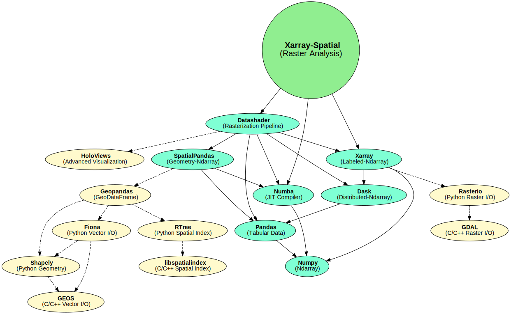

..  _getting_started.usage:

*****
Usage
*****

Basic Pattern
==============

.. code-block:: python

   import xarray as xr
   from xrspatial import hillshade

   my_dataarray = xr.DataArray(...)
   hillshaded_dataarray = hillshade(my_dataarray)

Check out the user guide `here <https://github.com/makepath/xarray-spatial/blob/master/examples/user_guide>`_.

Dependencies
============

``xarray-spatial`` currently depends on Datashader, but will soon be updated to depend only on ``xarray`` and ``numba``\ , while still being able to make use of Datashader output when available. 

Notes on GDAL
=============

Within the Python ecosystem, many geospatial libraries interface with the GDAL C++ library for raster and vector input, output, and analysis (e.g. rasterio, rasterstats, geopandas). GDAL is robust, performant, and has decades of great work behind it. For years, off-loading expensive computations to the C/C++ level in this way has been a key performance strategy for Python libraries (obviously...Python itself is implemented in C!).

However, wrapping GDAL has a few drawbacks for Python developers and data scientists:

* GDAL can be a pain to build / install.
* GDAL is hard for Python developers/analysts to extend, because it requires understanding multiple languages.
* GDAL's data structures are defined at the C/C++ level, which constrains how they can be accessed from Python.

With the introduction of projects like Numba, Python gained new ways to provide high-performance code directly in Python, without depending on or being constrained by separate C/C++ extensions. ``xarray-spatial`` implements algorithms using Numba and Dask, making all of its source code available as pure Python without any "black box" barriers that obscure what is going on and prevent full optimization. Projects can make use of the functionality provided by ``xarray-spatial`` where available, while still using GDAL where required for other tasks.
